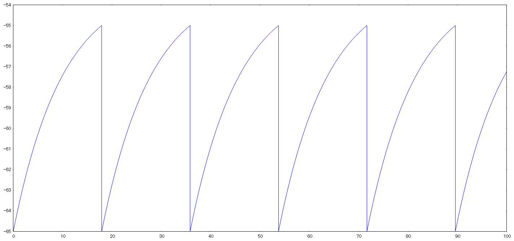
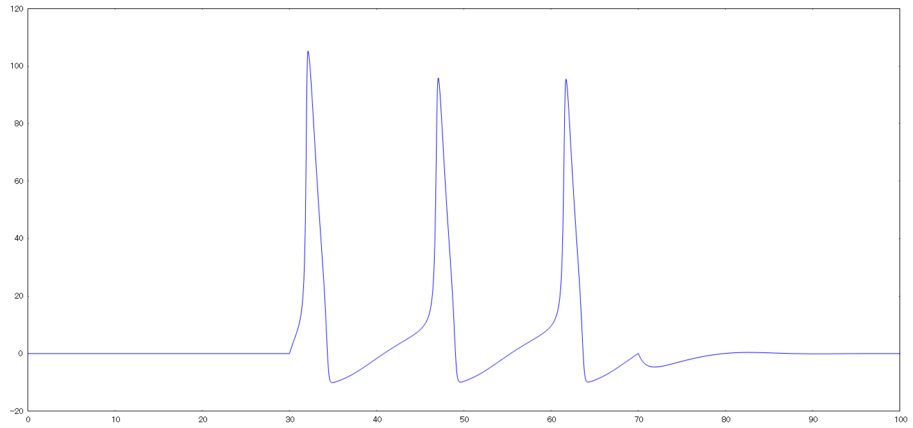
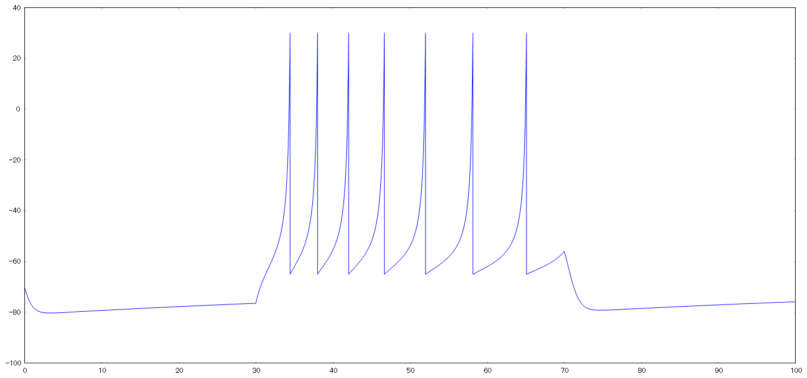
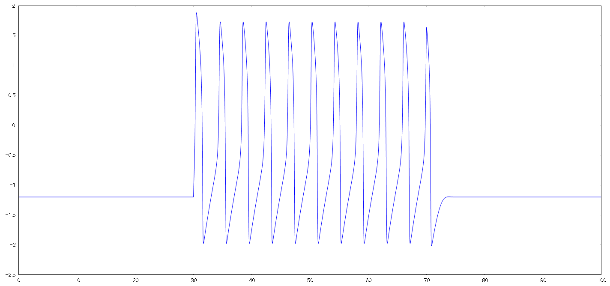
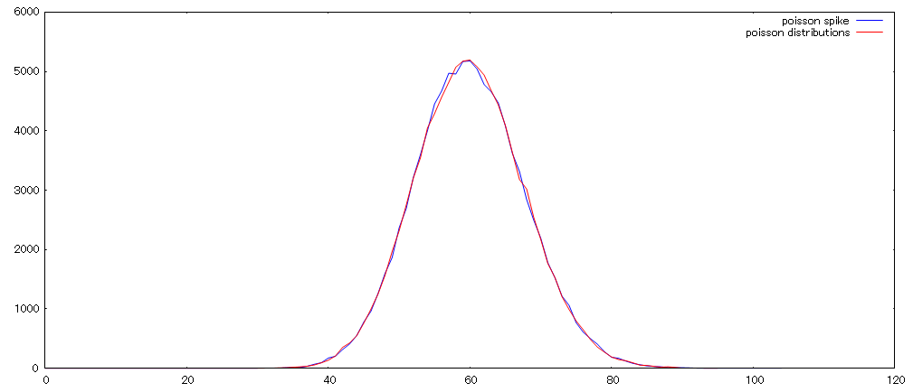

# neuron model

## Integrate-and-fire
[if.rs](https://github.com/suzusuzu/neuron-model/blob/master/src/bin/if.rs)

```sh
cargo run --release --bin if
gnuplot -p < if.plt
```



## Hodgkin–Huxley

[hh.rs](https://github.com/suzusuzu/neuron-model/blob/master/src/bin/hh.rs)

```sh
cargo run --release --bin hh
gnuplot -p < hh.plt
```



## Izhikevich

[iz.rs](https://github.com/suzusuzu/neuron-model/blob/master/src/bin/iz.rs)

```sh
cargo run --release --bin iz
gnuplot -p < iz.plt
```



## FitzHugh-Nagumo

[fn.rs](https://github.com/suzusuzu/neuron-model/blob/master/src/bin/fn.rs)

```sh
cargo run --release --bin fn
gnuplot -p < fn.plt
```



## Poisson Spike

[ps.rs](https://github.com/suzusuzu/neuron-model/blob/master/src/bin/ps.rs)

```sh
cargo run --release --bin ps
gnuplot -p < ps.plt
```



